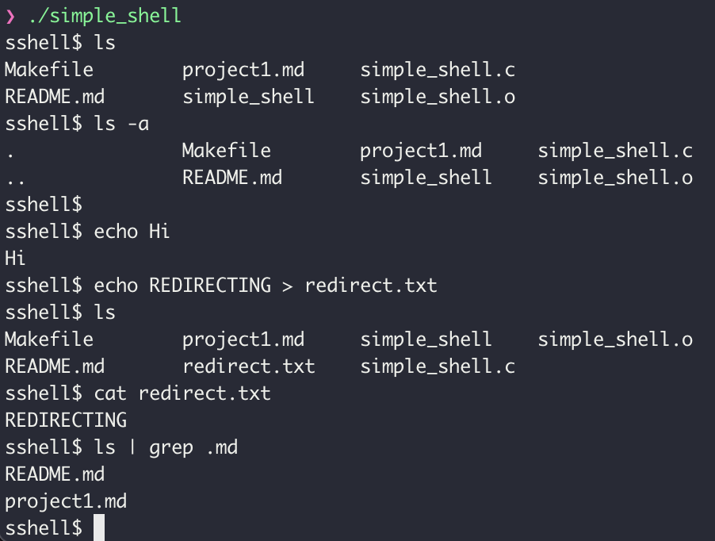

# Project1: Simple UNIX Shell

## 소개

[프로젝트 요구사항](project1.md)에 맞추어 기본적인 기능을 수행하는 UNIX 쉘을 구현하는 프로젝트입니다.

## 실행방법

C언어를 컴파일 하기 위한 `gcc` 컴파일러 설치가 필요합니다.

Windows 운영체제의 경우 `unistd.h` 라이브러리를 사용하기 위해 추가적인 설정이 필요할 수 있습니다.

