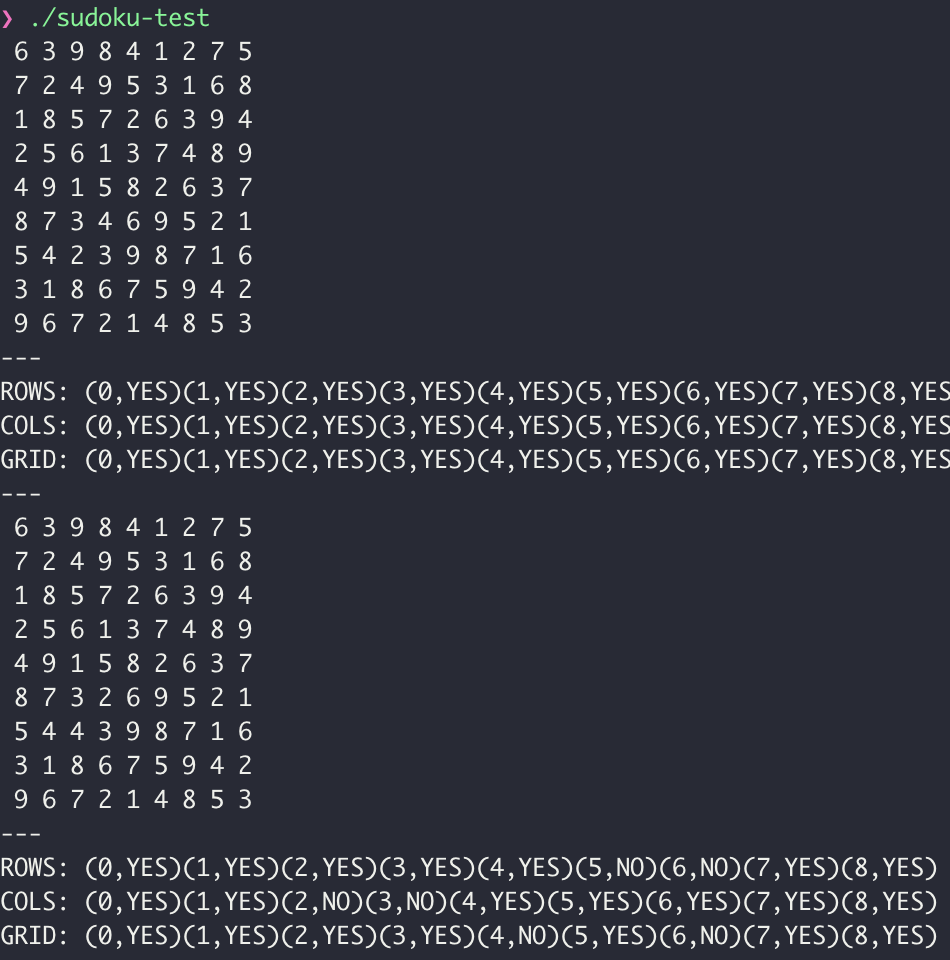

# Sudoku Solution Validator

## 소개



2021년도 1학기 한양대학교 ERICA 운영체제론 수업에서 진행한 두번째 프로젝트입니다. [프로젝트 요구사항](requirement.md)에 맞추어 스도쿠 퍼즐(Sudoku Puzzle)을 스레드를 이용하여 변경하면서 검증해보는 실험을 하기 위한 프로젝트입니다.

## 기능

본 프로그램에는 다음과 같은 세 가지 함수를 통해 스도쿠 퍼즐의 행, 열, 그리고 서브 그리드가 올바른지 검사합니다. 여기서 '올바르다'는 각 행, 열, 서브 그리드에 1부터 9까지의 숫자가 하나씩 포함되어 있다는 것을 의미합니다.

* `void *check_rows(void *arg)`
* `void *check_columns(void *arg)`
* `void *check_subgrid(void *arg)`

위와 같은 검증 프로세스를 여러 조건에서 총 4번 시행합니다.
    
    1. 올바른 스도쿠 퍼즐 그리드에서 검증 프로세스를 시행합니다.
    2. 올바른 스도쿠 퍼즐 그리드에서 두 점의 숫자를 바꾼 후 검증 프로세스를 시행합니다.
    3. 서브그리드를 무작위로 섞는 `void *shuffle_sudoku(void *arg)` 함수를 실행하는 프로세스를 생성하여 실행시키면서 검증 프로세스를 시행합니다.
    4. 3번에서 시행한 `void *shuffle_sudoku(void *arg)` 프로세스가 종료된 후 검증 프로세스를 시행합니다.

각 검증 프로세스별로 다음과 같이 행, 열, 서브 그리드별로 올바르다면 YES를, 올바르지 않다면 NO를 출력합니다.

```
ROWS: (0,YES)(1,YES)(2,YES)(3,YES)(4,YES)(5,YES)(6,YES)(7,YES)(8,YES)
COLS: (0,YES)(1,YES)(2,YES)(3,YES)(4,YES)(5,YES)(6,YES)(7,YES)(8,YES)
GRID: (0,YES)(1,YES)(2,YES)(3,YES)(4,YES)(5,YES)(6,YES)(7,YES)(8,YES)
```

## 실행방법

저장소의 파일들을 받은 후 다음 명령어를 입력합니다. 이후 4회에 걸쳐 검증 프로세스를 실행하며 결과를 출력합니다.

```shell
./sudoku-test
```

프로그램을 수정하고 컴파일 하기 위해서는 `gcc` 컴파일러 설치가 필요합니다.

> 만약 **Windows** 운영체제의 경우 **`pthread.h`** 라이브러리를 사용하기 위해 추가적인 설정이 필요할 수 있습니다.