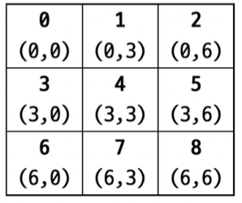
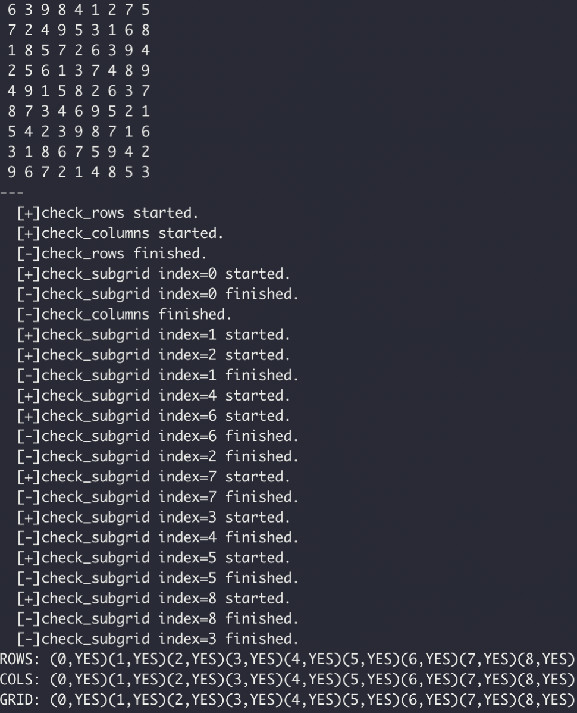
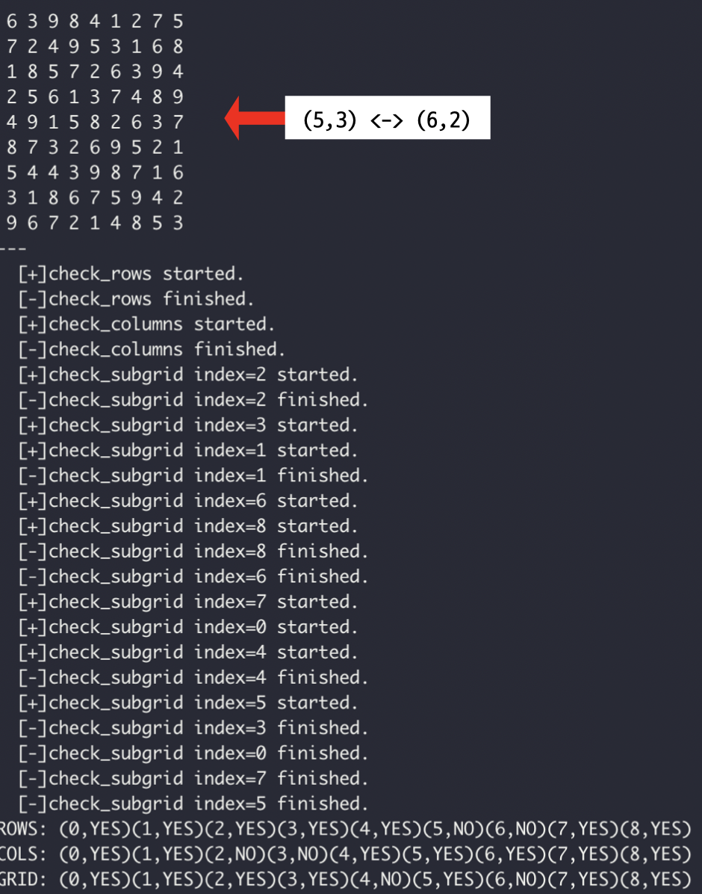
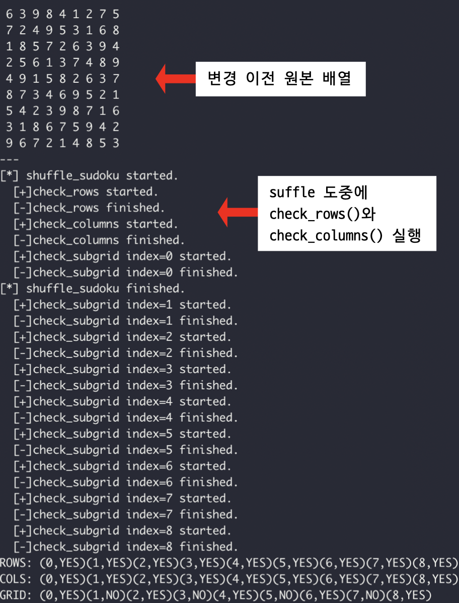
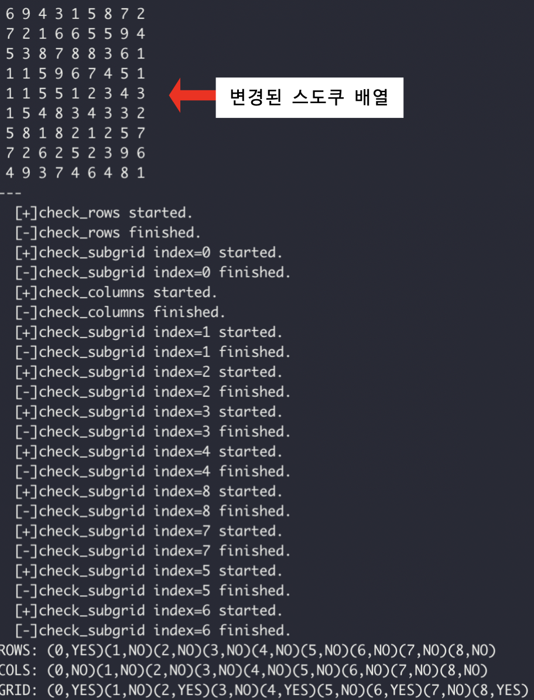

# 제출 보고서 정리

프로젝트를 진행하고 소스코드와 함께 제출한 보고서를 정리한 문서입니다.

## 코드 설명

### contain_number 배열

모든 함수에 공통적으로 포함되어 있는 contain_number 배열은 현재 검사하는 행/열/서브그리드에 대해서 대상이 1부터 9까지 숫자를 각각 몇개를 포함하고 있는지 나타내는 배열입니다.

```C++
contain_number[i] == N // 대상 행/열/서브 그리드에 i라는 숫자가 N개 포함
```

### check_rows()

각 행(row)이 1 부터 9 까지 숫자를 하나씩 포함하고 있는지 검사하는 함수입니다. 모든 행을 순회하면서, contain_number 에 포함하는 숫자의 개수를 기록합니다.

```contain_number[sudoku[i][j]]``` 값이 0 으로 계산되었다면, 대상을 검사할 때 해당 숫자가 중복되었다는 것을 의미하므로 valid 값을 0 으로 저장합니다.

### check_columns()

각 열(column)이 1부터 9까지 숫자를 하나씩 포함하고 있는지 검사하는 함수입니다. 마찬가지로 모든 열을 순회하면서 ```contain_number```값을 이용해 valid 값을 변경합니다.

### check_subgrid()

서브그리드의 시작 위치인 ```args```를 인자로 입력받고, 입력받은 위치를 기준으로 ```row_begin + col_begin/3``` 연산으로 몇 번째 서브 그리드인지 계산합니다.

아래는 (row_begin, col_begin)에 따른 서브 그리드 번호를 나타낸 그림입니다.



## 소스코드

[sudoku-solution-validator.c](src/sudoku-solution-validator.c)

## 결과

### 첫 번째 검증 프로세스



* 올바른 원본 스도쿠 배열을 변화시키지 않고 검증합니다.
* 따라서 모두 Valid 하다고 출력됩니다.

### 두 번째 검증 프로세스



* 원본 스도쿠 배열에서 (5,3)위치의 원소와 (6,2) 위치의 원소를 서로 바꾼 후 검증합니다.
* 따라서 5행, 6행, 2열, 3열, 그리고 4번째 서브그리드와 6번째 서브그리드에서 Invalid하다고 출력됩니다.

### 세 번째 검증 프로세스



* 스도쿠 배열을 이상하게 섞는 `shuffle_sudoku()` 함수를 실행하는 스레드를 실행하는 중에 검증합니다.
* `pthread_join()` 과 같은 함수로 스레드의 종료를 기다리지 않고 실행합니다.
* 위의 실행 에시처럼, `shuffle_sudoku()`가 끝나기 전에 `check_rows()`와 `check_columns()`의 실행이 종료됩니다.
* **즉, 스레드를 사용할 때 동시에 읽기와 쓰기가 진행되는 경우 예상할 수 없는 결과가 발행한다는 것을 나타냅니다.**

### 네 번째 검증 프로세스



* 마지막으로 `shuffle_sudoku()` 함수를 `pthread_join()`을 이용해 종료를 기다린 후 검증합니다.
* 많은 부분이 랜덤하게 변경되어 대부분이 NO로 정상 검증 되는 것을 볼 수 있습니다.
* 세 번째 검증 프로세스와 달리 쓰는 도중에 읽지 않으므로 정확한 검사 결과가 출력됩니다.