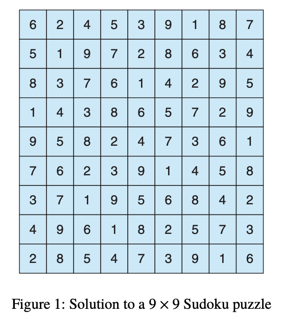

# Sudoku Solution Validator 프로젝트 요구사항

## Sudoku Solution Validator

A Sudoku puzzle uses a 9 × 9 grid in which each column and row, as well as each of the nine 3 × 3 subgrids, must contain all of the digits 1 ~ 9. **Figure 1** presents an example of a valid Sudoku puzzle. This project consists of designing a multithreaded application that determines whether the solution to a Sudoku puzzle is valid. There are several different ways of multithreading this application. One suggested strategy is to create threads that check the following criteria:

* A thread to check that each column contains the digits 1 through 9
* A thread to check that each row contains the digits 1 through 9
* Nine threads to check that each of the 3 × 3 subgrids contains the digits 1 through 9

This would result in a total of eleven separate threads for validating a Sudoku puzzle.



## Passing Parameters to Each Thread

The parent thread will create the worker threads, passing each worker the location that it must check in the Sudoku grid. This step will require passing several parameters to each thread. The easiest approach is to create a data structure using a struct. For example, a structure to pass the row and column where a thread must begin validating would appear as follows:

```c
/* structure for passing data to threads */
typedef struct {
int row;
int column;
} location_t;
```

Pthreads programs will create worker threads using a strategy similar to that shown below:

```c
location_t *data = (location_t *)malloc(sizeof(location_t));
data->row = 0;
data->column = 0;
/* now create the thread passing data as a parameter */
```

The data pointer will be passed to the `pthread_create()` function, which in turn will pass it as a parameter to the function that is to run as a separate thread.

## Returning Results to the Parent Thread

Each worker thread is assigned the task of determining the validity of a particular region of the Sudoku puzzle. Once a worker has performed this check, it must pass its results back to the parent. One good way to handle this is to create an array of integer values that is visible to each thread. The i-th index in this array corresponds to the i-th worker thread. If a worker sets its corresponding
value to 1, it is indicating that its region of the Sudoku puzzle is valid. A value of 0 indicates otherwise. When all worker threads have completed, the parent thread checks each entry in the result array to determine if the Sudoku puzzle is valid.

## Best Coding Practices

바람직하지 않은 코딩 스타일에 대한 감점이 있다.
1. 프로그램의 가독성 (들여쓰기와 형식의 일관성 등)
2. 코드에대한설명(주석등)
3. 알기쉬운변수명사용과불필요한상수사용회피등
4. 프로그램의 확장성
5. 프로그램의 효율성
6. 기타 바람직한 프로그래밍 원칙에 위배되는 경우 (https://en.wikipedia.org/wiki/Best_coding_practices)

## 골격 파일

이번 프로그래밍 프로젝트는 골격 파일인 `proj2.skeleton.c`를 학생들에게 제공한다. 학생들은 골격 파일 내에 미완성으로 남아 있는 몇 개의 함수를 목적에 맞게 완성해야 하는데, 그 함수의 목록은 다음과 같다.
* `void *check_rows(void *arg)`: 스도쿠 퍼즐의 9개 행의 구성이 올바른지 검사하는 함수이다. 하나의 스레드가 이 함수를 수행하게 한다. 매개변수 arg는 사용하지 않는다.
* `void *check_columns(void *arg)`: 스도쿠 퍼즐의 9개 열의 구성이 올바른지 검사하는 함수이다. 하나의 스레드가 이 함수를 수행하게 한다. 매개변수 arg는 사용하지 않는다.
* `void *check_subgrid(void *arg)`: 스도쿠 퍼즐의 3 × 3 서브그리드의 구성이 올바른지 9개 서브그리드 중 어느 하나를 검사하는 함수이다. 어떤 위치에 있는 서브그리드를 검사할 것인지는 매개변수 arg를 통해 정보를 전달한다. 이 함수를 사용하여 9개의 스레드가 각기 다른 위치에 있는 서브그리드의 구성을 검사하게 한다.
* `void check_sudoku(void)`: 스도쿠 퍼즐이 올바르게 구성되어 있는지 11개의 스레드를 생성하여 검증한다. 한 스레드는 각 행이 올바른지 검사하고, 다른 한 스레드는 각 열이 올바른지 검사한다. 9개의 3x3 서브그리드에 대한 검증은 9개의 스레드를 생성하여 동시에 검사한다.

## 참고사항

이 과제는 Operating System Concepts 10판 4장 프로그래밍 프로젝트와 같다.