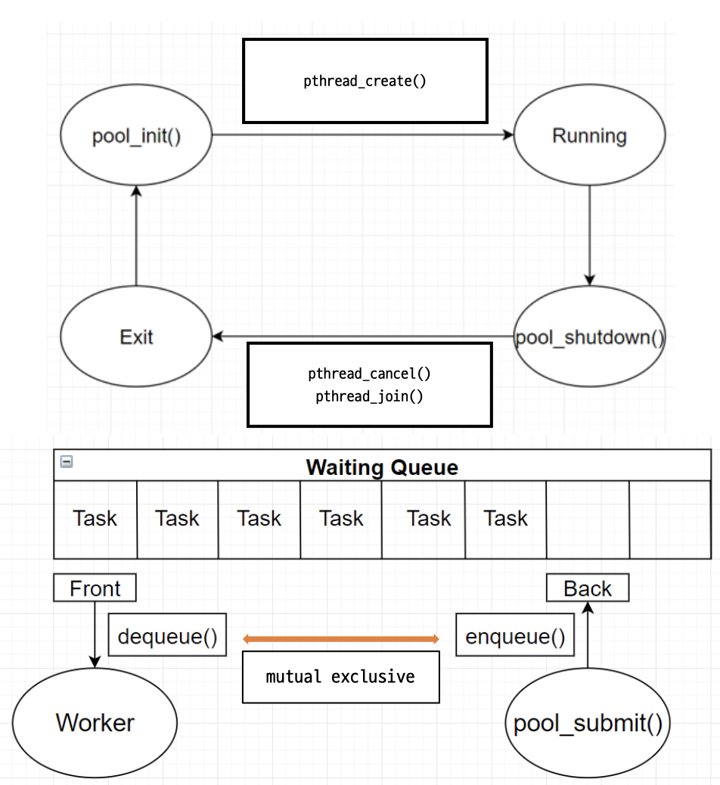

# Thread Pool


## 소개

2021년도 1학기 한양대학교 ERICA 운영체제론 수업에서 진행한 네번째 프로젝트입니다. [프로젝트 요구사항](requirement.md)에 맞추어 스레드풀이 잘 동작하도록 구현하고, 스레드풀이 잘 동작하는지를 확인해보는 프로그램을 구현한다.


## 기능

본 프로그램은 다음의 함수들로 기능을 수행합니다.
    
    1. pool_init() 을 이용하여 Worker 스레드와 변수를 초기화합니다. pool_shutdown() 를 이용하면 Worker 스레드에 철회 신호를 보내고 종료를 기다립니다.
    2. enqueue() 를 이용하면 Waiting Queue의 Back 위치에 Task를 넣을 수 있습니다.
    3. dequeue() 를 이용하면 Waiting Queue의 Front 위치에서 Task를 가져올 수 있습니다.
    4. pool_submit() 은 enqueue()가 성공했을 때 Waiting Queue의 대기하고 있는 Task수인 세마포어 값을 1 증가시킵니다.
    5. Worker 스레드는 세마포어를 확인해서 Task를 가지고 올 수 있다면 dequeue()를 호출하여 Task를 가져오고 세마포어를 1 감소시킵니다.

다음은 해당 기능들을 정리한 도표입니다.



## 실행방법

저장소의 파일들을 받은 후 다음 명령어를 입력합니다. 이후 10개의 Task를 보관할 수 있는 Waiting Queue와 3개의 Worker 스레드를 생성하고, 32개의 숫자 출력 Task를 입력합니다. 큐의 개수보다 Task의 개수가 더 많기 때문에 몇몇 Task 입력 시 오류 메세지를 출력하고, 마지막에 2개의 아무것도 하지 않는 Task와 1개의 곰돌이 푸 출력 Task를 입력하고 종료합니다.


```shell
./client
```

프로그램을 수정하고 컴파일 하기 위해서는 `gcc` 컴파일러 설치가 필요합니다.

> 만약 **Windows** 운영체제의 경우 **`pthread.h`** 라이브러리를 사용하기 위해 추가적인 설정이 필요할 수 있습니다.